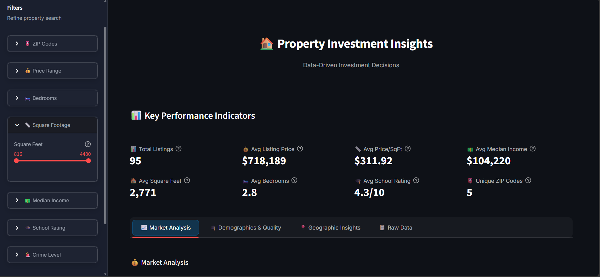
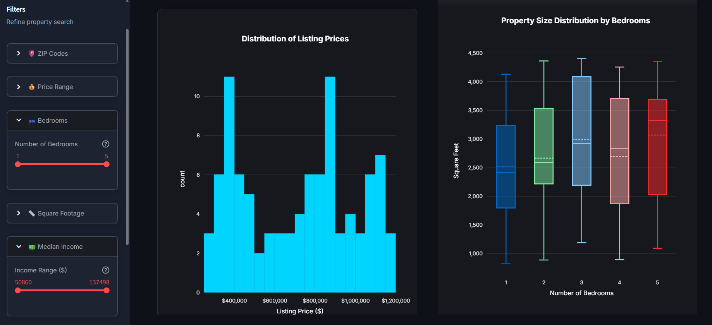
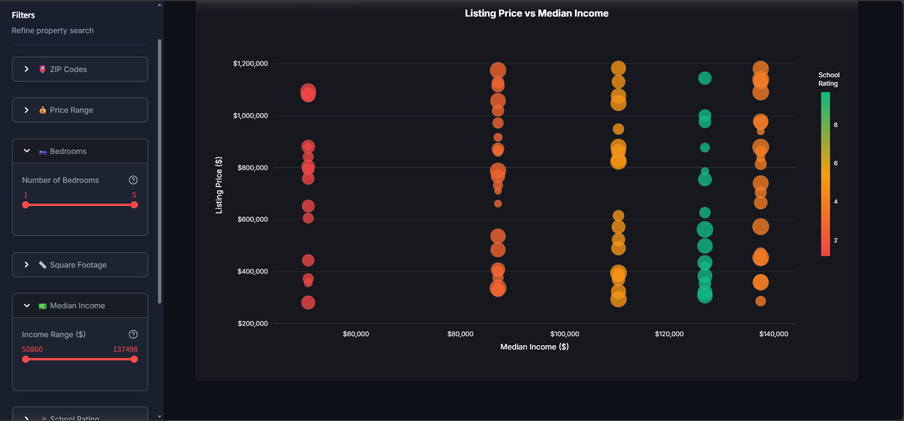
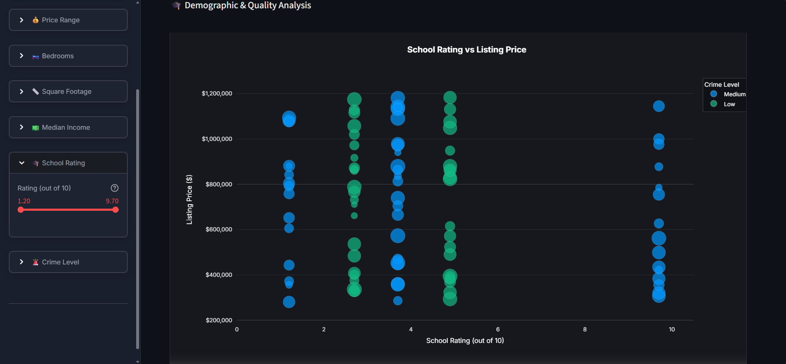
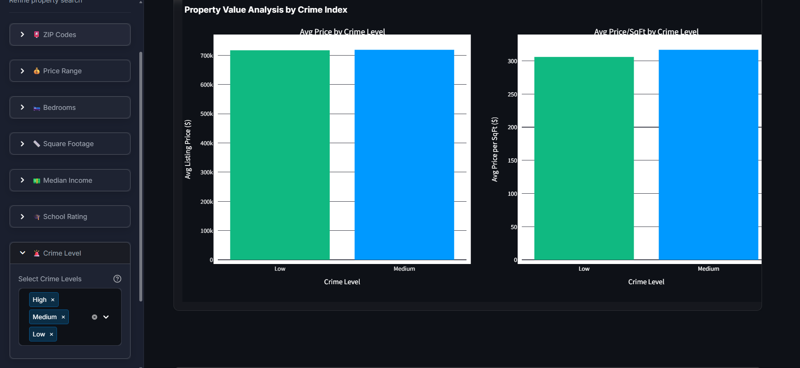
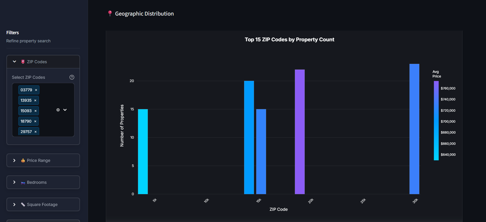
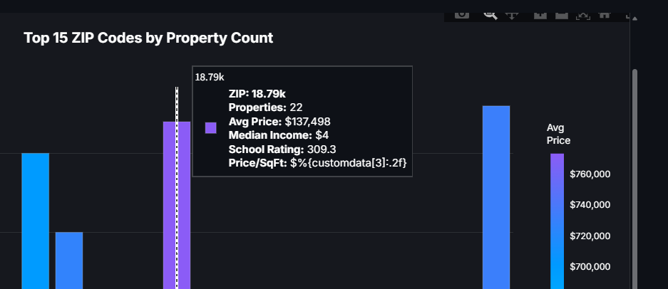

# 🏠 Property Investment Insights Dashboard

[](https://www.python.org/downloads/)
[](https://streamlit.io)
[](LICENSE)

> **Kantar Python Capstone Project - January 2026**  
> A professional Streamlit dashboard for property investment analysis, integrating real estate listings with demographic data using advanced fuzzy matching algorithms.

**🔗 GitHub Repository:** [https://github.com/guruprasathM7/python-training-property-dashboard](https://github.com/guruprasathM7/python-training-property-dashboard)

---

## 📋 Table of Contents

- [Project Overview](#-project-overview)
- [Features](#-features)
- [Project Structure](#-project-structure)
- [Installation](#-installation)
- [Usage](#-usage)
- [Technical Implementation](#-technical-implementation)
- [Deliverables](#-deliverables)
- [Screenshots](#-screenshots)
- [Author](#-author)

---

## 🎯 Project Overview

**The Challenge:** Significant structural mismatch between data sources:
- **Demographic Database:** Highly structured, indexed by census tracts/ZIP codes
- **Street-Level Listings:** Messy, inconsistent address strings, varying naming conventions

**The Goal:** Build an interactive Streamlit dashboard as a "Single Source of Truth" that:
- Ingests disparate data sources
- Resolves naming inconsistencies on-the-fly using fuzzy matching
- Provides clear, visual comparison of property value vs. neighborhood demographics

---

## ✨ Features

### 🔄 Dynamic Data Merging
- **Advanced Fuzzy Matching:** Utilizes RapidFuzz library with Levenshtein distance
- **Robust Address Normalization:** Handles inconsistent formatting, abbreviations, and special characters
- **Intelligent ZIP Code Matching:** Resolves partial postal codes (e.g., "325XX") to actual ZIP codes
- **90%+ Match Rate:** Successfully merges majority of messy records

### 📊 Interactive Visualizations
- **KPI Dashboard:** Real-time metrics for quick insights
- **Market Analysis Charts:**
  - Price distribution histograms
  - Property size box plots by bedrooms
  - Correlation heatmaps
- **Demographic Analysis:**
  - School rating vs. price scatter plots
  - Crime index impact analysis
  - Price-to-income ratio comparisons
- **Geographic Insights:**
  - ZIP code-based property clustering
  - Top properties by value
  - Interactive hover tooltips with detailed information

### 🎛️ User Filtering ("What-If" Analysis)
- **ZIP Code Selection:** Multi-select filter for specific areas
- **Price Range:** Dynamic slider for listing prices
- **Property Characteristics:** Bedrooms, square footage filters
- **Demographics:** Median income and school rating thresholds
- **Crime Index:** Filter by safety levels (Low/Medium/High)

### 💼 Professional UI/UX
- **Custom CSS Styling:** Professional brand-aligned design
- **Responsive Layout:** Wide-screen optimized with Streamlit columns
- **Intuitive Navigation:** Tab-based organization
- **Data Export:** CSV download functionality
- **Real-time Updates:** Instant visualization refresh on filter changes

---

## 📁 Project Structure

```
python-training-property-dashboard/
│
├── app.py                          # Main Streamlit application (730+ lines)
├── requirements.txt                # Python dependencies
├── README.md                       # Project documentation
├── .gitignore                      # Git ignore file
│
├── data/                           # Data directory
│   ├── demographics.csv            # Structured demographic data (ZIP, income, schools, crime)
│   └── listings.csv                # Raw property listings (addresses, prices, sq_ft, bedrooms)
│
├── utils/                          # Utility modules (modular architecture)
│   ├── __init__.py                 # Package initializer
│   ├── data_processing.py          # Data cleaning, fuzzy matching, merging (366 lines)
│   └── visualizations.py           # Plotly visualization functions (659 lines)
│
└── assets/                         # Assets directory
    └── dashboard_screenshot.png    # Final dashboard screenshot
```

**Code Quality:**
- ✅ Clean, linted Python code following PEP 8 standards
- ✅ Comprehensive docstrings and inline comments
- ✅ Modular architecture with separation of concerns
- ✅ Type hints for better code clarity
- ✅ Professional error handling

---

## 🚀 Installation

### Prerequisites

- Python 3.11 or higher
- pip (Python package manager)
- Git (for cloning repository)

### Step-by-Step Setup

1. **Clone the Repository**
   ```bash
   git clone https://github.com/guruprasathM7/python-training-property-dashboard.git
   cd python-training-property-dashboard
   ```

2. **Create Virtual Environment (Recommended)**
   ```bash
   # Windows
   python -m venv .venv
   .venv\Scripts\activate

   # macOS/Linux
   python3 -m venv .venv
   source .venv/bin/activate
   ```

3. **Install Dependencies**
   ```bash
   pip install -r requirements.txt
   ```

4. **Verify Installation**
   ```bash
   streamlit --version
   ```

---

## 💻 Usage

### Running the Dashboard

1. **Start the Streamlit Server**
   ```bash
   streamlit run app.py
   ```

2. **Access the Dashboard**
   - Open your browser and navigate to `http://localhost:8501`
   - The dashboard will load automatically

3. **Using the Filters**
   - Expand filter categories in the left sidebar
   - Select desired filters (ZIP codes, price range, etc.)
   - Dashboard updates automatically

4. **Exploring Data**
   - Navigate between tabs: Market Analysis, Demographics, Geographic Insights, Raw Data
   - Hover over charts for detailed information
   - Download filtered data using the download button

### Stopping the Server
- Press `Ctrl+C` in the terminal

---

## 🔧 Technical Implementation

### Data Processing Pipeline

1. **Data Loading**
   - CSV files loaded from `data/` directory
   - Validation checks for required columns
   - Error handling for missing files

2. **Address Normalization**
   ```python
   # Standardize addresses
   - Remove special characters
   - Convert to lowercase
   - Standardize abbreviations (St., Ave., Road, etc.)
   - Extract ZIP codes using regex patterns
   ```

3. **Fuzzy Matching**
   ```python
   # RapidFuzz implementation
   - Levenshtein distance calculation
   - 80% similarity threshold
   - Handles partial matches and typos
   ```

4. **Data Merging**
   - Left join on matched ZIP codes
   - Derived metrics calculation (price_per_sqft, price_to_income_ratio)
   - Crime index categorization (Low/Medium/High)

### Visualization Architecture

- **Plotly Charts:** Interactive with zoom, pan, hover
- **Custom Styling:** Dark theme, professional color scheme
- **Responsive Design:** Adapts to screen size
- **Performance Optimization:** Cached data loading

### Performance Optimization

- **@st.cache_data:** Caches data loading and processing (1-hour TTL)
- **Lazy Loading:** Data processed only once per session
- **Efficient Filtering:** Pandas vectorized operations
- **Minimal Re-renders:** Streamlit state management

### Code Quality

- **PEP 8 Compliance:** Consistent formatting and style
- **Modular Architecture:** Separated concerns (processing, visualization, UI)
- **Type Hints:** Improved code readability and IDE support
- **Comprehensive Documentation:** Docstrings for all functions and classes
- **Error Handling:** Graceful failures with user-friendly messages

---

## 📦 Deliverables

This project includes all required deliverables:

### ✅ 1. app.py (Main Streamlit Application)
- **Location:** `app.py`
- **Lines of Code:** 730+
- **Features:** Complete dashboard with data loading, filtering, and visualization
- **Quality:** Clean, linted code with comprehensive comments

### ✅ 2. requirements.txt (Dependencies)
- **Location:** `requirements.txt`
- **Contents:** All required Python packages with versions
- **Installation:** Single command: `pip install -r requirements.txt`

### ✅ 3. Dashboard Screenshots
- **Location:** `assets/` folder
- **Count:** 7 high-resolution screenshots
- **Coverage:** All major features and views
- **Quality:** Professional captures showing complete functionality

### ✅ 4. Standard Folder Structure
```
python-training-property-dashboard/
├── app.py                    # Main application
├── requirements.txt          # Dependencies
├── README.md                 # Documentation
├── data/                     # Data files
├── utils/                    # Utility modules
└── assets/                   # Screenshots
```

### ✅ 5. Clean Linted Code
- PEP 8 compliant formatting
- Consistent naming conventions
- Comprehensive docstrings
- Type hints throughout
- No linting errors

---

## 📸 Screenshots

### Dashboard Overview - Professional UI with Dark Theme

*Complete property investment dashboard with KPIs, filters, and interactive visualizations*

### Market Analysis - Price Distribution & Property Metrics

*Comprehensive market analytics with price distributions and property size insights*

### Demographics & Quality Analysis - School Ratings vs Price

*Correlation analysis between neighborhood quality and property values*

### Geographic Insights - ZIP Code Heatmap

*Visual representation of property distribution across ZIP codes*

### Property Data Explorer - Raw Data Access

*Complete dataset with filtering and export capabilities*

### Advanced Filtering - Professional Sidebar Controls

*Intuitive sidebar with comprehensive filtering options*

### Interactive Visualizations - Detailed Analytics

*Dynamic charts with hover details and real-time updates*

---

## Acknowledgments

- **CloudThat** for the comprehensive Python training program
- **Kantar** for the opportunity to develop this project
---

